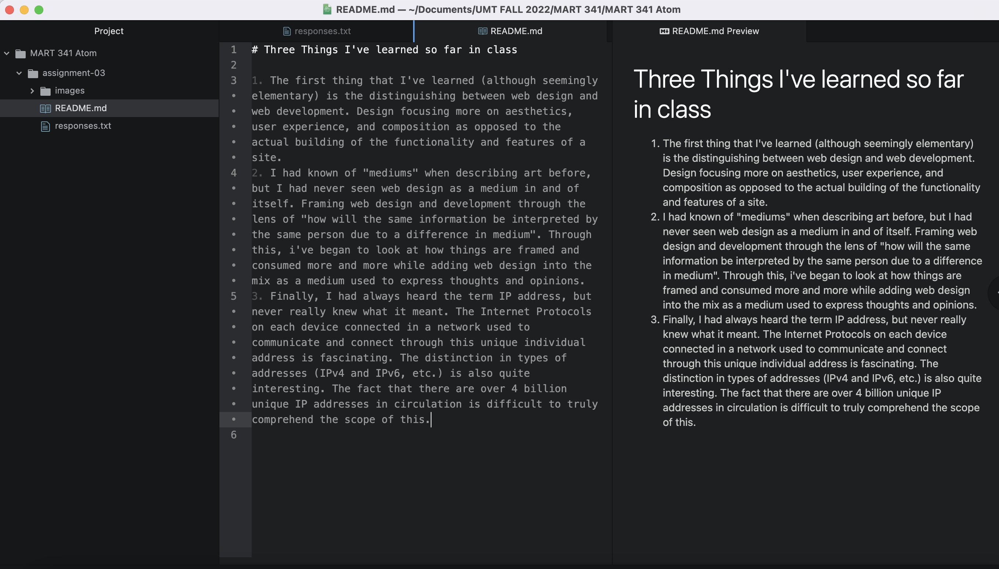

# Three Things I've learned so far in class

1. The first thing that I've learned (although seemingly elementary) is the distinguishing between web design and web development. Design focusing more on aesthetics, user experience, and composition as opposed to the actual building of the functionality and features of a site.
2. I had known of "mediums" when describing art before, but I had never seen web design as a medium in and of itself. Framing web design and development through the lens of "how will the same information be interpreted by the same person due to a difference in medium". Through this, i've began to look at how things are framed and consumed more and more while adding web design into the mix as a medium used to express thoughts and opinions.
3. Finally, I had always heard the term IP address, but never really knew what it meant. The Internet Protocols on each device connected in a network used to communicate and connect through this unique individual address is fascinating. The distinction in types of addresses (IPv4 and IPv6, etc.) is also quite interesting. The fact that there are over 4 billion unique IP addresses in circulation is difficult to truly comprehend the scope of this.

[My Responses](./responses.txt)

