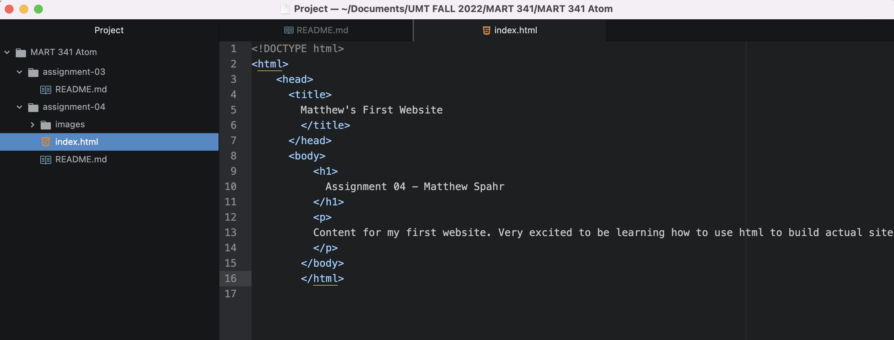

# How Browsers Function:
Browsers are a program used to enter the internet.
A web browser sends a request to a server and it responds with web content and the browser interprets the content and displays it as a page.
The three web languages used by web designers (HTML,CSS,JavaScript) are used to write specific instructions and directions for layouts of pages and placement on a page.

I personally use Safari and Chrome for surfing the web.

