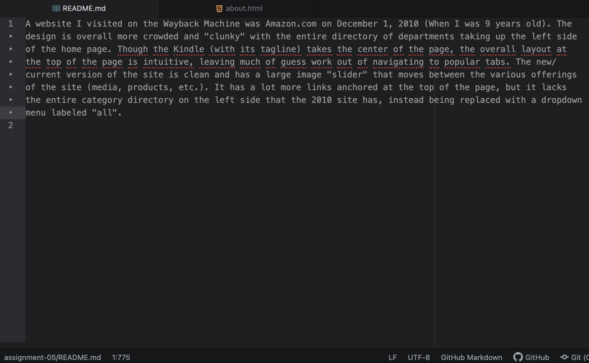

A website I visited on the Wayback Machine was Amazon.com on December 1, 2010 (When I was 9 years old). The design is overall more crowded and "clunky" with the entire directory of departments taking up the left side of the home page. Though the Kindle (with its tagline) takes the center of the page, the overall layout at the top of the page is intuitive, leaving much of guess work out of navigating to popular tabs. The new/current version of the site is clean and has a large image "slider" that moves between the various offerings of the site (media, products, etc.). It has a lot more links anchored at the top of the page, but it lacks the entire category directory on the left side that the 2010 site has, instead being replaced with a dropdown menu labeled "all".

