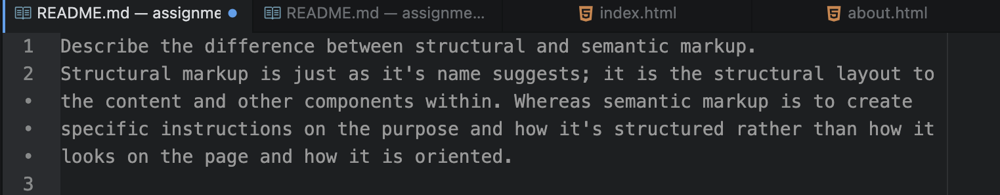

Describe the difference between structural and semantic markup.
Structural markup is just as it's name suggests; it is the structural layout to the content and other components within. Whereas semantic markup is to create specific instructions on the purpose and how it's structured rather than how it looks on the page and how it is oriented.

