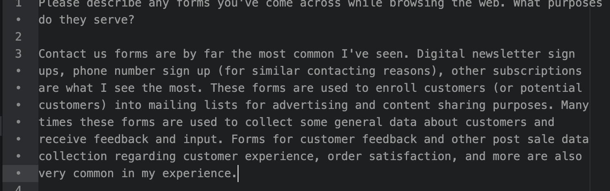
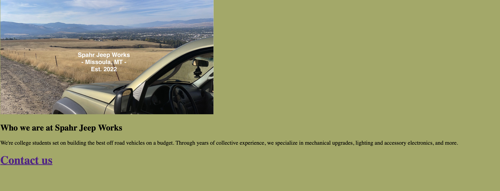
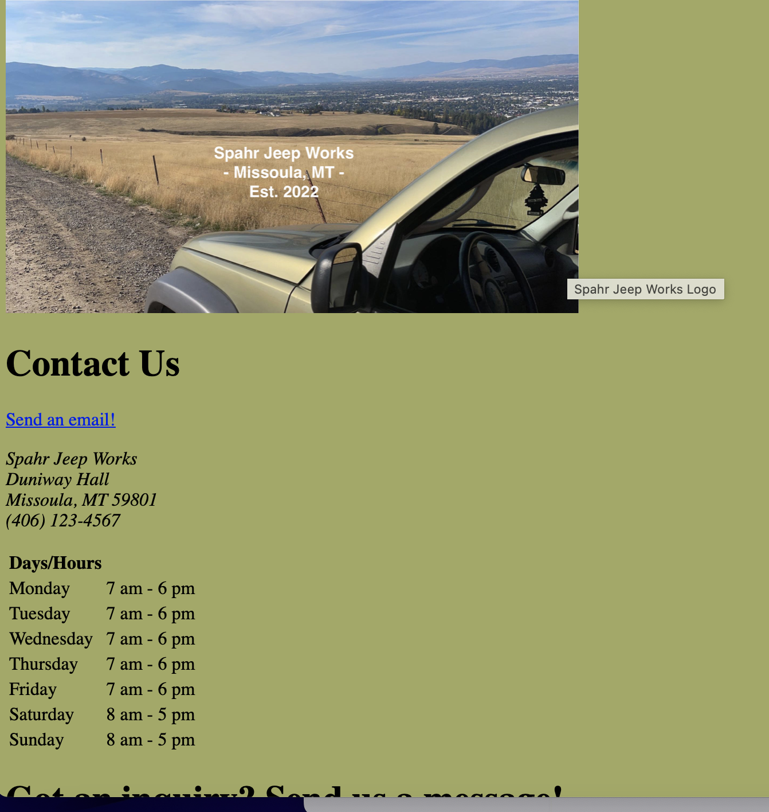

Please describe any forms you've come across while browsing the web. What purposes do they serve?

Contact us forms are by far the most common I've seen. Digital newsletter sign ups, phone number sign up (for similar contacting reasons), other subscriptions are what I see the most. These forms are used to enroll customers (or potential customers) into mailing lists for advertising and content sharing purposes. Many times these forms are used to collect some general data about customers and receive feedback and input. Forms for customer feedback and other post sale data collection regarding customer experience, order satisfaction, and more are also very common in my experience.

