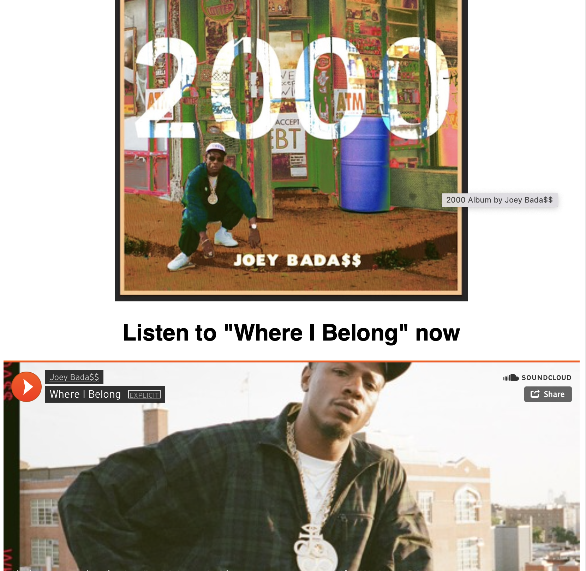
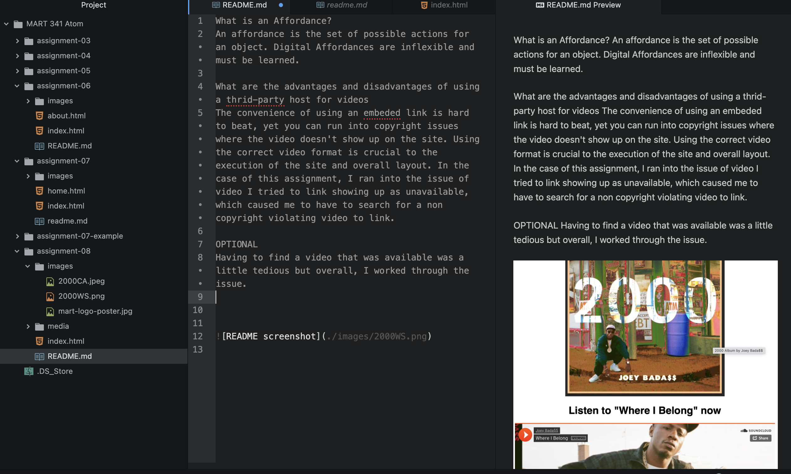

What is an Affordance?
An affordance is the set of possible actions for an object. Digital Affordances are inflexible and must be learned.

What are the advantages and disadvantages of using a thrid-party host for videos
The convenience of using an embeded link is hard to beat, yet you can run into copyright issues where the video doesn't show up on the site. Using the correct video format is crucial to the execution of the site and overall layout. In the case of this assignment, I ran into the issue of video I tried to link showing up as unavailable, which caused me to have to search for a non copyright violating video to link.

OPTIONAL
Having to find a video that was available was a little tedious but overall, I worked through the issue.

