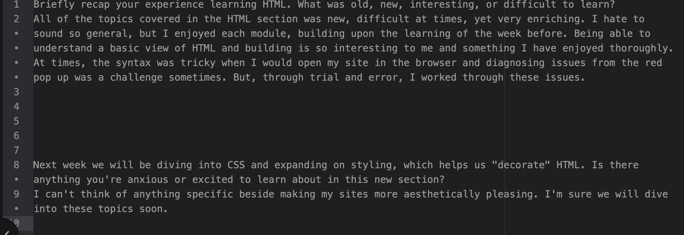

Briefly recap your experience learning HTML. What was old, new, interesting, or difficult to learn?
All of the topics covered in the HTML section was new, difficult at times, yet very enriching. I hate to sound so general, but I enjoyed each module, building upon the learning of the week before. Being able to understand a basic view of HTML and building is so interesting to me and something I have enjoyed thoroughly. At times, the syntax was tricky when I would open my site in the browser and diagnosing issues from the red pop up was a challenge sometimes. But, through trial and error, I worked through these issues.

Next week we will be diving into CSS and expanding on styling, which helps us "decorate" HTML. Is there anything you're anxious or excited to learn about in this new section?
I can't think of anything specific beside making my sites more aesthetically pleasing. I'm sure we will dive into these topics soon.

