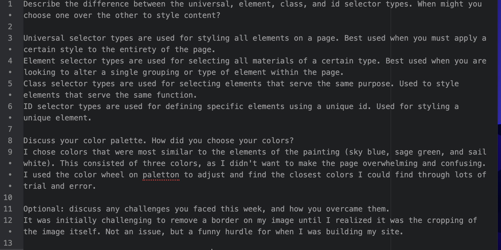

Describe the difference between the universal, element, class, and id selector types. When might you choose one over the other to style content?

Universal selector types are used for styling all elements on a page. Best used when you must apply a certain style to the entirety of the page.
Element selector types are used for selecting all materials of a certain type. Best used when you are looking to alter a single grouping or type of element within the page.
Class selector types are used for selecting elements that serve the same purpose. Used to style elements that serve the same function.
ID selector types are used for defining specific elements using a unique id. Used for styling a unique element.

Discuss your color palette. How did you choose your colors?
I chose colors that were most similar to the elements of the painting (sky blue, sage green, and sail white). This consisted of three colors, as I didn't want to make the page overwhelming and confusing. I used the color wheel on paletton to adjust and find the closest colors I could find through lots of trial and error.

Optional: discuss any challenges you faced this week, and how you overcame them.
It was initially challenging to remove a border on my image until I realized it was the cropping of the image itself. Not an issue, but a funny hurdle for when I was building my site.

