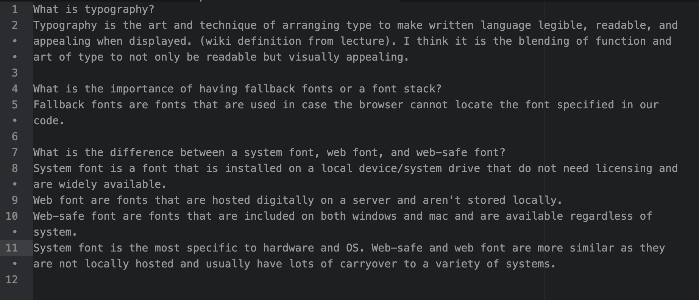

What is typography?
Typography is the art and technique of arranging type to make written language legible, readable, and appealing when displayed. (wiki definition from lecture). I think it is the blending of function and art of type to not only be readable but visually appealing.

What is the importance of having fallback fonts or a font stack?
Fallback fonts are fonts that are used in case the browser cannot locate the font specified in our code.

What is the difference between a system font, web font, and web-safe font?
System font is a font that is installed on a local device/system drive that do not need licensing and are widely available.
Web font are fonts that are hosted digitally on a server and aren't stored locally.
Web-safe font are fonts that are included on both windows and mac and are available regardless of system.
System font is the most specific to hardware and OS. Web-safe and web font are more similar as they are not locally hosted and usually have lots of carryover to a variety of systems.

