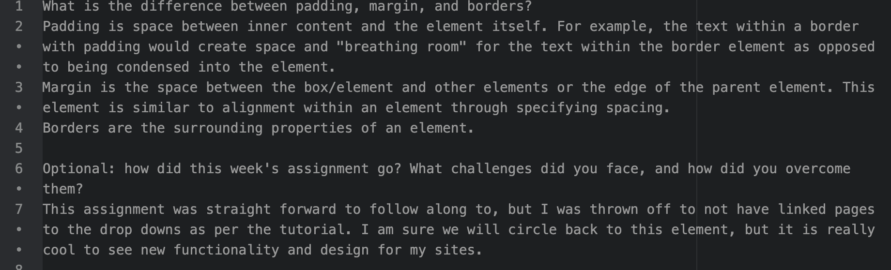

What is the difference between padding, margin, and borders?
Padding is space between inner content and the element itself. For example, the text within a border with padding would create space and "breathing room" for the text within the border element as opposed to being condensed into the element.
Margin is the space between the box/element and other elements or the edge of the parent element. This element is similar to alignment within an element through specifying spacing.
Borders are the surrounding properties of an element.

Optional: how did this week's assignment go? What challenges did you face, and how did you overcome them?
This assignment was straight forward to follow along to, but I was thrown off to not have linked pages to the drop downs as per the tutorial. I am sure we will circle back to this element, but it is really cool to see new functionality and design for my sites.

