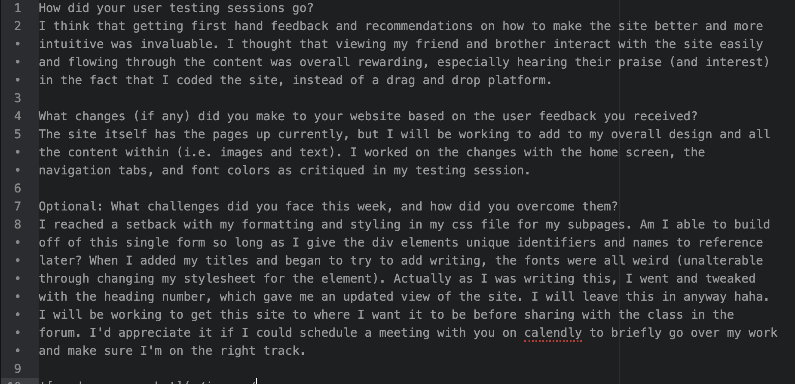

How did your user testing sessions go?
I think that getting first hand feedback and recommendations on how to make the site better and more intuitive was invaluable. I thought that viewing my friend and brother interact with the site easily and flowing through the content was overall rewarding, especially hearing their praise (and interest) in the fact that I coded the site, instead of a drag and drop platform.

What changes (if any) did you make to your website based on the user feedback you received?
The site itself has the pages up currently, but I will be working to add to my overall design and all the content within (i.e. images and text). I worked on the changes with the home screen, the navigation tabs, and font colors as critiqued in my testing session.

Optional: What challenges did you face this week, and how did you overcome them?
I reached a setback with my formatting and styling in my css file for my subpages. Am I able to build off of this single form so long as I give the div elements unique identifiers and names to reference later? When I added my titles and began to try to add writing, the fonts were all weird (unalterable through changing my stylesheet for the element). Actually as I was writing this, I went and tweaked with the heading number, which gave me an updated view of the site. I will leave this in anyway haha. I will be working to get this site to where I want it to be before sharing with the class in the forum. I'd appreciate it if I could schedule a meeting with you on calendly to briefly go over my work and make sure I'm on the right track.

